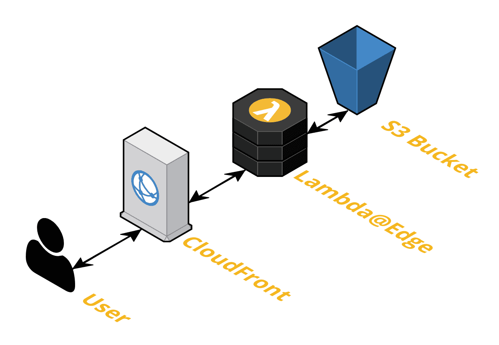

Tachyon@Edge is a fork of [Tachyon](https://engineering.hmn.md/projects/tachyon/) and built with some strong opinions and assumptions:

- Runs on Amazon Web Services (using CloudFront and Lambda@Edge.)
- Expects original image files to be stored on Amazon S3.

Tachyon works best with WordPress, coupled with [S3 Uploads](github.com/humanmade/s3-uploads) and the [Tachyon Plugin](https://github.com/humanmade/tachyon-plugin).

---

## Installing

TKTK

## Using

Tachyon provides a simple HTTP interface in the form of:

`https://{tachyon-domain}/my/image/path/on/s3.png?w=100&h=80`

It's really that simple!

Requests that aren't images (gif, jpg, png, webp) get passed through to the S3 bucket for CloudFront to serve as is. Images can be processed via query strings. 

#### Args Reference

| URL Arg | Type | Description |
|---|----|---|
|`w`|Number|Max width of the image.|
|`h`|Number|Max height of the image.|
|`resize` `fit`|String, "w,h"|Resize and crop an image to exact width,height pixel dimensions.|
|`quality`|Number, 0-100|Image quality (JPG and WEBP only).|
|`crop`|String, "x,y,w,h"|Crop an image by percentages x-offset,y-offset,width,height (x,y,w,h). Percentages are used so that you don’t need to recalculate the cropping when transforming the image in other ways such as resizing it. `crop=160px,160px,788px,788px` takes a 788 by 788 square starting at 160 by 160.|
|`webp`|Boolean, 1|Force WebP format.|
|`lb`|String, "w,h"|Add letterboxing effect to images, by scaling them to width, height while maintaining the aspect ratio and filling the rest with black or `background`.|
|`background`|String|Add background color via name (red) or hex value (%23ff0000). Don't forget to escape # as `%23`.|
|`negative`|Boolean, 1|Reverse the colors of the image.|
|`flip`|Boolean, 1|Flip the image vertically.|
|`flop`|Boolean, 1|Flip the image horizontally.|
|`rotate`|0, 90, 180, 270| Rotate the image a certain number of degrees.|
|`grayscale` `greyscale`| Boolean, 1|Convert the image to grayscale| 

For more details checkout the [docs](https://engineering.hmn.md/projects/tachyon/).

## How Does It Work?
 - A request comes to CloudFront
 - A Lambda@Edge function intercepts the request form CloudFront to the origin server (Amazon S3 bucket)
 - The Lambda function handles resizing images (files that end with .jpg, .gif, .png, or .webp) and saving them to a directory in the S3 bucket (`/resized/`)
 - The request to the origin is modified allowing CloudFront to serve the processed image 

## Differences from Tachyon
 - By using Lambda@Edge functions we can manipulate a request to the origin server rather than handling the serving of the image within the Lambda function itslef
 - API Gateway has limits with the size of responses causing internal server errors for larger files
 - Can handle requests for any kind of file, not just images
 - Non-image requests are passed through to the S3 bucket
 - No need to use the API Gateway service which saves money
 - Added a few more options for manipulating images (`rotate`, `grayscale`, `negative`)

## Credits
Props to [Human Made](https://humanmade.com/) for the original [Tachyon project](https://engineering.hmn.md/projects/tachyon/) written and maintained by [Joe Hoyle](https://github.com/joehoyle).

Tachyon is inspired by Photon by Automattic. As Tachyon is not an all-purpose image resizer, rather it uses a media library in Amazon S3, it has a different use case to [Photon](https://jetpack.com/support/photon/).

Tachyon uses the [Sharp](https://github.com/lovell/sharp) (Used under the license Apache License 2.0) Node.js library for the resizing operations, which in turn uses the great libvips library.
